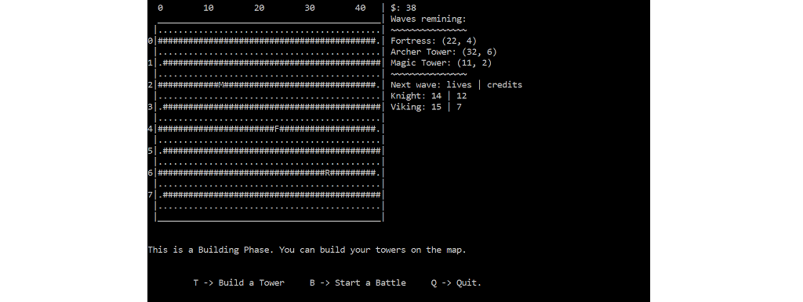

# Tower Game
## Project within the scope of the subject **"Designing and object-oriented programming"**. 
Joanna Broniarek



The repository contains the implementation of the game "Tower Game" which is run from the console.
The aim of the project was to use various design patterns in Python.
The whole code was written by me.

Contain
-----------------------------------
+ game.py - which is the main file to initialise the game
+ mapp.py
+ rivals.py
+ simulation.py
+ towers.py

Technology
--------------------------------
Python version:  Python 2.7

Running
------------------------------------
To start the game, run in the console:
```
python game.py
```
Game Instructions
--------------------------------
#### Towers:
F - Fortress:
+ kills mainly flying rivals
+ the special effect 'shrapnels' gives a chance to kill flying rivals

A - Alkazar:
+ kills only flying rivals
+ there is no special effect

R - ArcherTower:
+ kills only overland rivals
+ the special effect 'poisonous arrows'

M - MagicTower:
+ kills only overland rivals
+ the special effect 'poleaxing'

#### Rivals:
+ flying: Paratrooper, Dragon
+ overland: Knight, Viking, Speeder

#### Building Phase.
During this phase you can build your towers on the map by typing "F", "A", "R", "M" according to the list above.
Then, you can specify the location of tower on the map.

### Change the Phase or Quit the game:
+ T -> Build a Tower     
+ B -> Start a Battle     
+ Q -> Quit.

# Have fun! :) 
